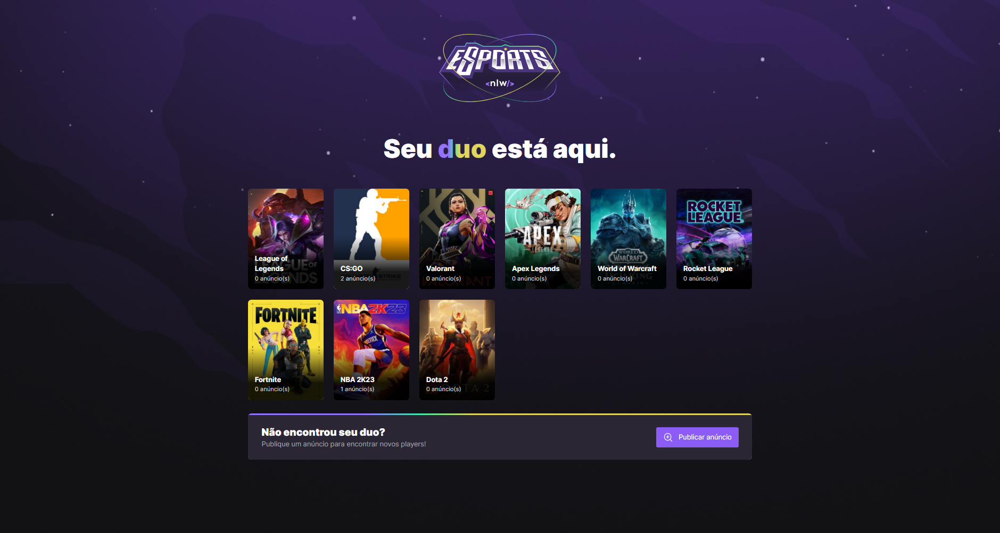

# NLW eSports

> Aplicação feita em React, React Native e NodeJS para conexão de pessoas que desejam companhia para jogar.

# Tecnologias Usadas

- React
- React Native
- NodeJS
- SQLite

[⬆ Voltar ao topo](#NLW-eSports) 
